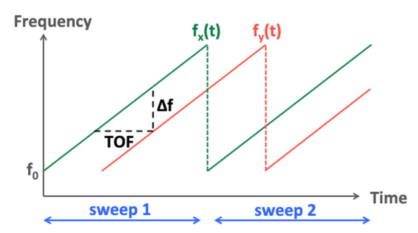
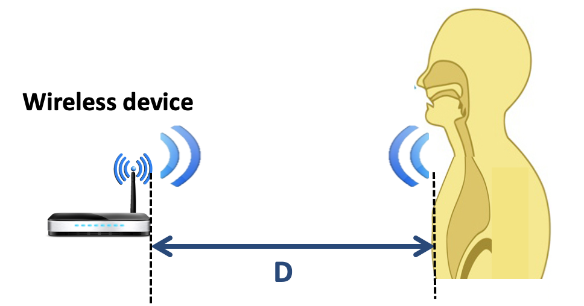
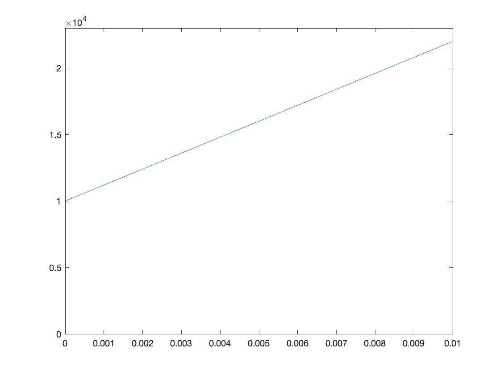
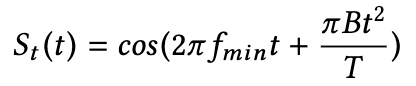
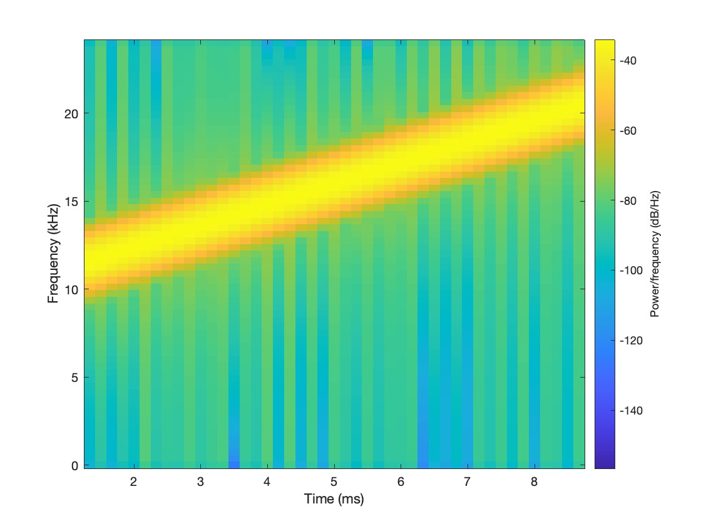
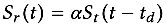
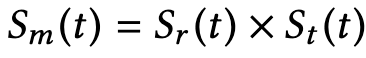
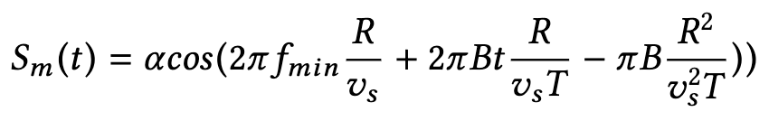
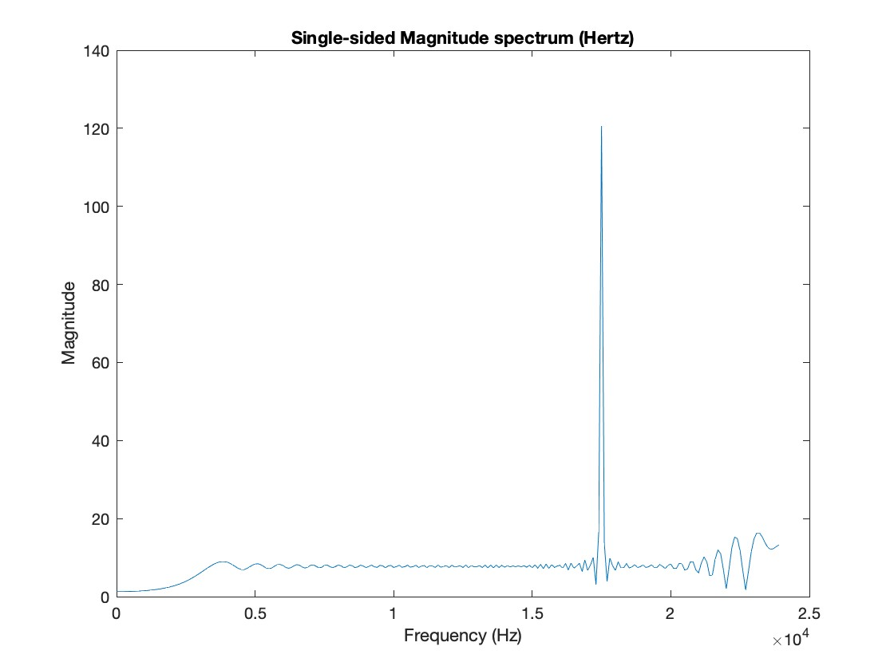

# Project 2 Primer: Distance Estimation with acoustic FMCW Signal
## Goal
* To understand how FWCW signal works to estimate distance

## Pre-Project Exercises: 
Before we enter Project 2, we are going to play with FMCW signal to gain some additional background that will help us in Project 2.

FMCW signal transmits a narrowband signal whose carrier frequency changes linearly with time for each sweep. 
	
The green line represents the transmitted signal where the frequency increases from f0 till fx(T), where T is the duration of one sweep or chirp (chirp duration). The figure shows 2 sweeps. 

The red line represents the received signal which is a delayed copy of the transmitted signal by &Delta;t (aka TOF, Time Of Flight)= distance traveled/speed of signal.

The basic idea for FMCW signal is since the received signal (RX) is a delayed copy of the transmitted signal (TX), by estimating the frequency difference between TX and RX (&Delta;f, which is easier to measure), we can estimate the time difference between TX and RX (&Delta;t, or TOF), and based on &Delta;t we can estimate the distance. 

Based on the FMCW signal figure. Answer the following questions.

* Q1: What is the slope of the TX signal (which is the same as the slope of RX signal) expressed in terms of Bandwidth B and Chirp duration T? [Put your answer here] -> Let's call this Equation 1.

* Q2: What is TOF expressed in terms of &Delta;f and the slope? [Put your answer here] --> Let's call this Equation 2. 

* Q3: What is the distance traveled by the wireless signal expressed in terms of speed of sound and TOF? [Put your answer here] --> Let's call this Equation 3. 

* Q4: Putting it all together: Using Eq 1, Eq 2, and Eq 3, how can you express the distance traveled in terms of speed of sound, &Delta;f, T, and B? [Pur your answer here] --> Let's call this Equation 4.

* Q5: As you can see from Equation 4, the only parameter we do not know thus need to measure is [Put your answer here]. 

Let's now talk specifics about our experiment setting. In our setting, the acoustic FMCW signal is transmitted from the wireless device and reaches the body and reflected back to the wireless device, thus distance traveled is 2*D where D is the one way distance from the device to the body. 
	

Also note the acoustic FMCW signal travels at 343 m/s (this is the speed of sound) and the frequency range used will be from 10kHz till 22kHz (Bandwidth of 12kH), which falls into the frequency range of sound. (Note the audible sound range is from 20Hz to 20kHz)

* Now let's generate FMCW signal. Type the following commands in MATLAB:
	```MATLAB
	Fs = 48000; % sampling rate in Hz
	Ts = 1/Fs; % duration of one sample
	fmin = 10000; % minimum frequency of FMCW in Hz
	B = 12000; % bandwidth of FMCW in Hz (fmax = fmin + B)
	chirpDuration=0.01; % duration of one sweep (one chirp) 
	K=chirpDuration*Fs; % number of samples in one chirp  
	t=(0:K-1)*Ts; % time stamps
	movingFreq = (0:K-1)*(B/K) + fmin; % FMCW signal increases frequency from fmin to fmin+B in one chirp
	
	figure;
	plot(t, movingFreq); % plot moving frequency against time
	ylim([0 fmax+1000])
	```
You should see a plot that appears as below. Frequency increases linearly with time from fmin to fmax. And this represents one sweep (or one chirp) of the signal. 
	

Let's generate FMCW in time domain where the actual equation is as follows: 
	

Also we will plot the signal in both time domain and in frequency domain. 
* Continue typing the following commands in MATLAB:
	```MATLAB
	TX=cos(2*pi*(1/2*t.^2 * B/chirpDuration + fmin*t)); % one chirp of FMCW signal 
	figure;
	plot(t, TX); % FMCW in time domain
	figure; 
	spectrogram(RX,'yaxis',128,120,128,Fs); % FMCW in frequency domai (note x axis is time)
	```
Now you should see two plots that appears as below. In the first plot, it is hard to see but frequency is increasing with time.   
	

In the spectogram plot, you can see clearly the signal is increasing from fmin to fmax with time which matches with the very first figure we generated with t vs movingFreq. You can read more about matlab's [spectogram function](https://www.mathworks.com/help/signal/ref/spectrogram.html). 
	.

What would received signal be? RX is the delayed copy of the TX signal. Thus in the St(t) equation shown above, instead of t, we can simply apply t-&Delta;t instead resulting below equation, where &alpha; is the attenuation factor and td is &Delta;t (i.e., TOF).

.

* Here in this pre-lab exercise, we generate RX for illustration purpose only, but in real setting RX will be measured at the wireless device. Let's continue typing below commands in MATLAB:
	```MATLAB
	d = 5; % the distance traveled (just picked 5 meter arbitrarily)
	c = 343; % speed of sound is 343 m/sec
	timeDelay = d/c;
	RX=cos(2*pi*(1/2*(t-timeDelay).^2 * B/chirpDuration + fmin*(t-timeDelay))); % assume no attenuation.
	figure;
	plot(t, RX); % received signal in time domain.
	```

Now the question is how can we measure &Delta;f based on RX signal. Note TX signal's parameters (i.e., fmin, Bandwidth, Chirp Duration, Sampling rate, etc) are well-known parameter at the receiver. 

What the receiver do is first it will filter the received signal so that it contains only the frequency components within the range of [fmin, fmax]. Then, it will "mix" (multiplies) the received RX signal with TX signal, which yields the following equation.



Let R = 2 * D, and Vs = speed of sound, then &Delta;t is R/Vs. Plugging &Delta;t = R/Vs and simplifying, Sm(t) becomes: 



Now focus on the second term with t (translate it to 2&pi;F t), then frequency F = BR/VsT. This means when we apply FFT of this signal and plot the magnitude, we will see clear peak at the frequency F, which is &Delta;f that we were looking for.  

* Let's get it working in MATLAB by continue typing below command: 
	```MATLAB
	prod = TX.*RX; % filtering code omitted. Mixing TX and RX.
	L = length(prod);
	Y = fft(prod);
	Mag_Y = abs(Y); % magnitude of FFT result
	
	bin_vals = [0 : L-1];
	freq_Hz = bin_vals*Fs/L;
	L_2 = ceil(L/2);
	figure;
	plot(freq_Hz(1:L_2), Mag_Y(1:L_2))
	xlabel('Frequency Bin Number')
	ylabel('Magnitude');
	title('Single-sided Magnitude spectrum (Hertz)');
	```
You should now see a plot as shown below. 
 
	    	
	
* Q6: What is the peak frequency in Hz you see here? [Put your answer here.]

* Q7: What is the estimated distance estimation based on Q6? [Put your answer here.]

* Q8: Note in this pre-project exercise we only used 1 chirp (1 sweep) of FMCW signal. Describe how you can use similar technique used here to estimate the distance that is changing over time (such as breathing human body). [Put your answer here.]
